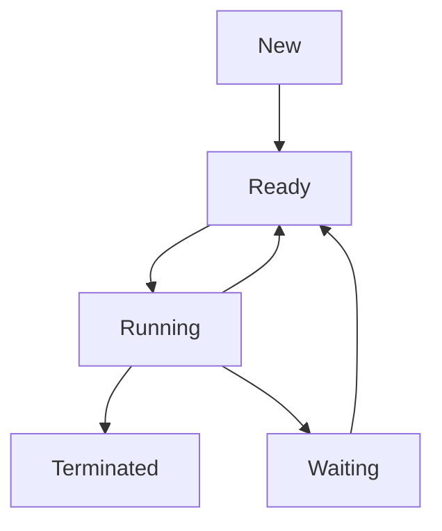
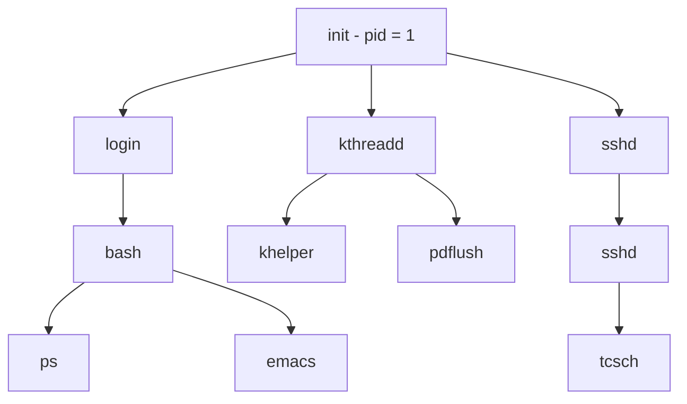

# Process Concept:
### An OS executes a variety of programs:
- Batch system - **Jobs**
- Time-shared systems - **User programs** or **Tasks**
- Could also be a program I have written like what we have been doing in [[Week 3 Programming Notes|programming]]

### Program is a passive entity stored on disk (**Executable file**):
- A process is active 
- Program becomes process when executable file loads into [[Week 3 Hardware Notes - Memory|memory]]

### One program can have several processes​:
- Consider multiple users executing the same program​
- Same user may open the same program multiple times, each of those are considered as separate processes 

### A process contains multiple parts:
- The program code, called **Text section**
- Current activity including **Program counter**, contents of processor’s registers​
- Stack containing temporary data(e.g. **function parameters**, **return addresses**, **local vars**)​
- Data section containing global data **(shared between processes)​**
- Heap containing memory allocated during run-time

> [!info]
> Both the stack and the data store data but the **Stack** stores temporary data, while the **Data** stores global data

### Stack vs Heap:
**Stack**:
- Used for static memory allocation​
- Very fast & local access (local variables), **limited size​**
- LIFO order **(Last In First Out)​**
- Automatically managed​
- Know exactly how much data you need to allocate before compiling

**Heap**:
- Used for dynamic memory allocation( blocks of memory are allocated and de-allocated in random fashion)
- Global access(global variables)
- Manually managed (malloc(), calloc(), free(), delete() systems calls) manual memory management refers to the usage of manual instructions by the programmer to identify and deallocate unused objects, or garbage( used in C, C++, etc.) In manual memory allocation, this is also specified manually by the programmer; via functions such as free() in C.
- Heap refers to larger pool of memory ​
- Don't know exactly how much data you need at runtime
- Allocating large size of data

# Process State:

- **new**:  The process is being created​
- **ready**:  The process is waiting to be assigned to a processor​
- **running**:  Instructions are being executed​
- **waiting**:  The process is waiting for some event to occur​
- **terminated**:  The process has finished execution

# Process Tree in Linux:

[[Boot Process]]

## Homework:
[[Week 3 OS Homework]]