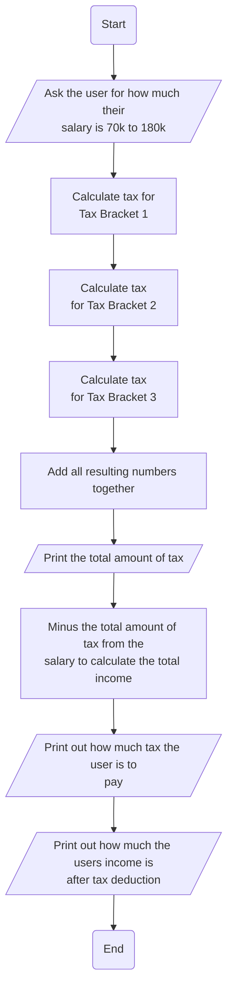

```mermaid
flowchart TD
S(Start) --> A
A[/Ask the user for how much their
salary is 70k to 180k/]
A --> B[Calculate tax for
Tax Bracket 1]
B --> C[Calculate tax
for Tax Bracket 2]
C --> D[Calculate tax
for Tax Bracket 3]
D --> E[Add all resulting numbers together]
E --> F[/Print the total amount of tax/]
F --> G[Minus the total amount of tax from the
salary to calculate the total income]
G --> H[/Print out how much tax the user is to
pay/]
H --> I[/Print out how much the users income is
after tax deduction/]
I --> T(End)
```
