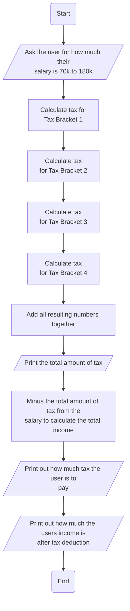

```mermaid
flowchart TD
S(Start) --> A
A[/Ask the user for how much their
salary is 70k to 180k/]
A --> B[Calculate tax for
Tax Bracket 1]
B --> C[Calculate tax
for Tax Bracket 2]
C --> D[Calculate tax
for Tax Bracket 3]
D --> E[Calculate tax
for Tax Bracket 4]
E --> F[Add all resulting numbers together]
F --> G[/Print the total amount of tax/]
G --> H[Minus the total amount of tax from the
salary to calculate the total income]
H --> I[/Print out how much tax the user is to
pay/]
I --> J[/Print out how much the users income is
after tax deduction/]
J --> T(End)
```
