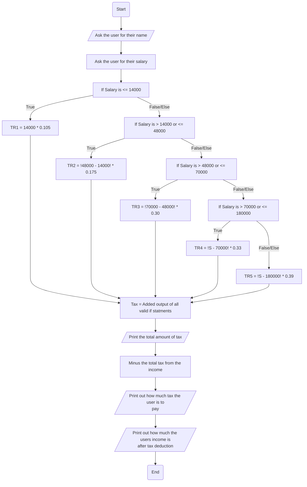

```mermaid
flowchart TD
S(Start) --> A[/Ask the user for their name/]
A --> B[Ask the user for their salary]
B --> C[If Salary is <= 14000]
C -->|True| D[TR1 = 14000 * 0.105]
C -->|False/Else| E[If Salary is > 14000 or <= 48000]
E -->|True| F[TR2 = !48000 - 14000! * 0.175]
E -->|False/Else| G[If Salary is > 48000 or <= 70000]
G -->|True| H[TR3 = !70000 - 48000! * 0.30]
G -->|False/Else| I[If Salary is > 70000 or <= 180000]
I -->|True| J[TR4 = !S - 70000! * 0.33]
I -->|False/Else| K[TR5 = !S - 180000! * 0.39]
L[Tax = Added output of all valid if statments]

D ------> L
F -----> L
H ----> L
J ---> L
K --> L

L --> M[/Print the total amount of tax/]
M --> N[Minus the total tax from the income]
N --> O[/Print out how much tax the user is to
pay/]
O --> P[/Print out how much the users income is
after tax deduction/]
P --> End(End)
```
