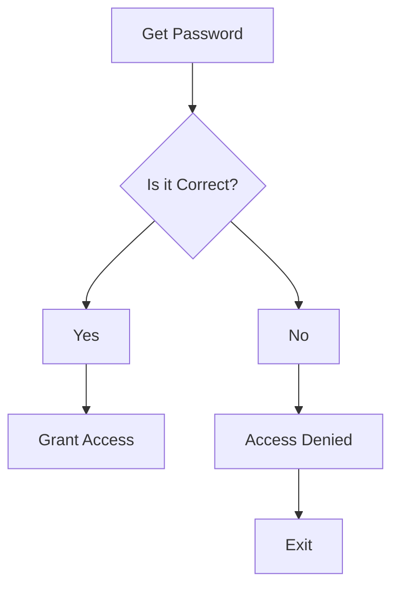
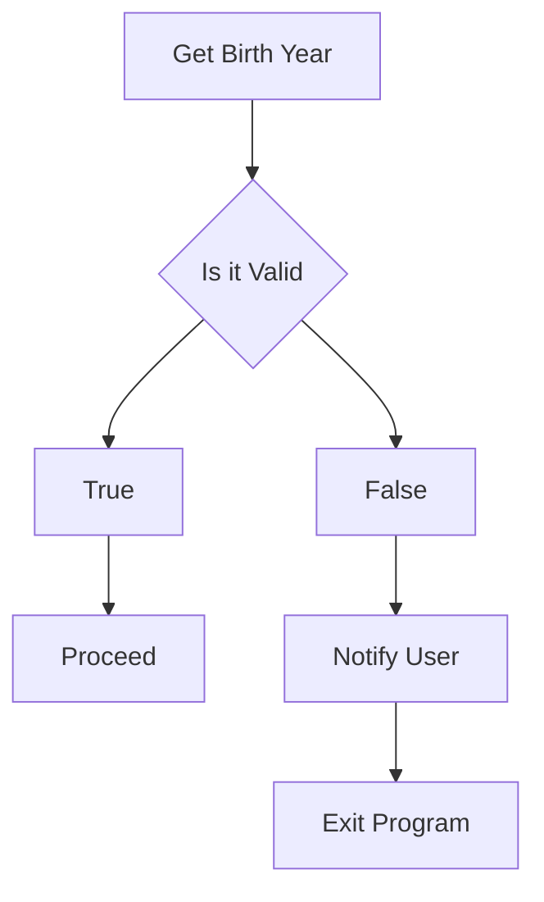
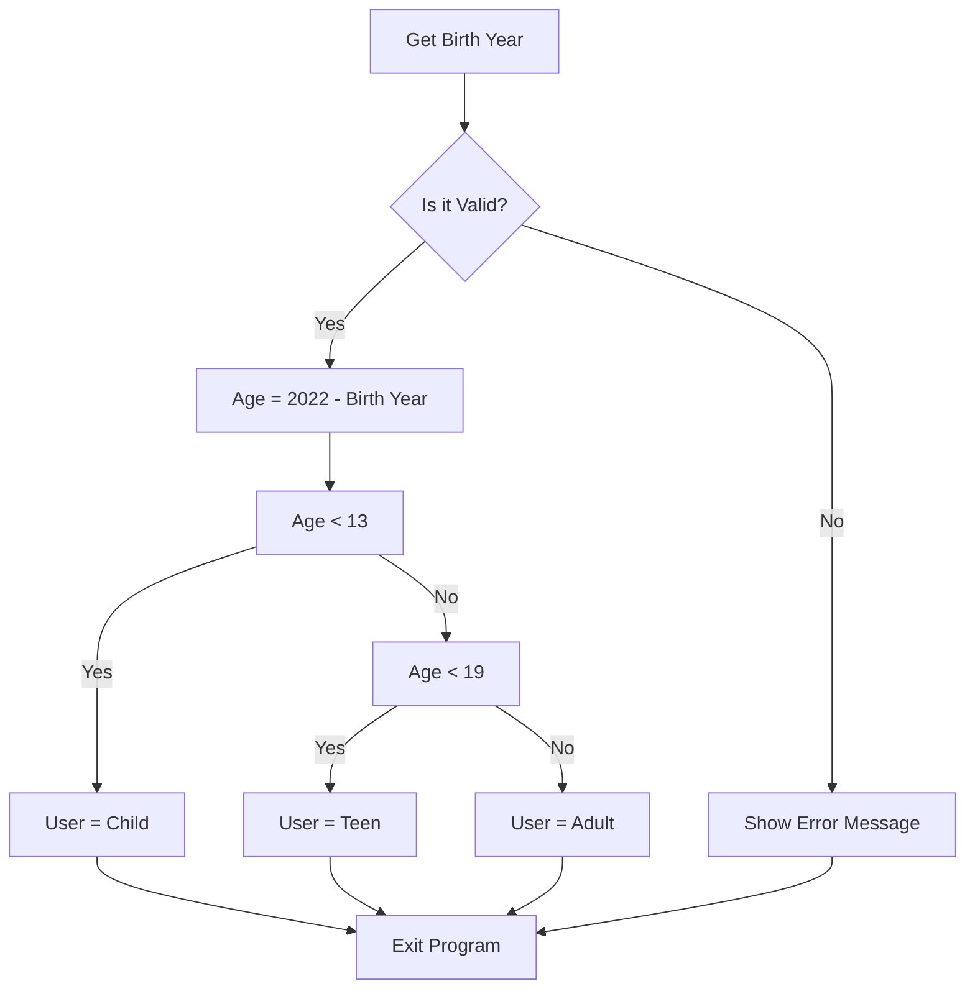

# What is Decision Making?:
### How do you make a decision:
- Need multiple choices
- Need to have conditions
- In programming, there should be logic behind every decision

### What do you need when making a decision:
- Decision Variables (data)
- Knowledge
- Decision Criteria

# Coding Conditions:
### If conditions:
`==` - Equals
`!=` - Does not Equal
`>` - Greater than
`<` - Less than
`>=` - Greater than or Equal to
`<=` - Less than or Equal to
`in` - Membership in a list

### And, or, not:
#### AND:
The AND operator is only true if both conditions that are being tested are true

#### OR:
The OR operator is true if one or more of the conditions that are being tested are true

#### NOT:
The NOT operator inverts the boolean value of any result of a condition

# Conditional Syntax Statements:


# Examples:
### Password Verification:


**Code Version**
```python
answer = input("Whats the password?: ")
password = "the cake is a lie"

if answer == password:
	print("Access granted")
else:
	print("Access denied")
	quit()
```
### Input Validation


**Code Version**
```python
Birthyear = int(input("Enter your age"))
if (Birthyear > 1900 and Birthyear < 2022) :
	Age = 2022 - Birthyear
	print("You are %d-year(s) old." %(Age))
```

### User Classification:


# Lab:
### Exercise 1:
[[Lab3_Ex1 Tax code calculator]]

### Exercise 2:
[[Lab3_Ex2 Updated Tax Calculator]]

> [!info]
> Builds on the week 2 task on tax calculators
> [[Lab2_Ex1 Tax calculator version 1]]
> [[Lab2_Ex2 Tax calculator version 2]]
> [[Lab2_Ex3 Tax calculator version 3]]

### Exercise 3:
[[Lab3_Ex3 Random number guessing game]]